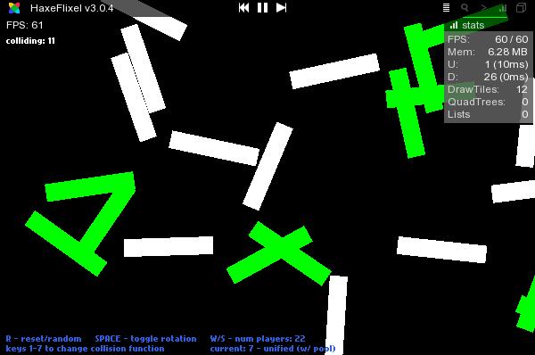

FlixelRotatedCollisionTest
==========================

Testing/improving rotated pixel perfect collision in HaxeFlixel.

progress
---------

 * Working out on pixel perfect collision code to hopefully found a way to make it faster enough to be usable on non-flash targets.
 * Interactive demo to test it is included.
 * First tries (NoCache and NewCache) were a step forward but still buggy in some cases
 * Added a (quite _naive_) BMDPool class to reuse temp BitmapData.
 * In DebugCollision I've found the bug in previous tentatives (pixels ByteArrays not aligned/bad size, so giving wrong results)
 * FinalCollision is the last iteration of the code (with and without pooling)
 * FinalUnifiedCollision uses _almost_ the same code for Flash and non-Flash targets (uses pooling and performs slightly better than the previous Flash implementation - aka blend color trick)
 
You can check it right away by running the demo: the collision code is independent from HaxeFlixel, calls local classes.

